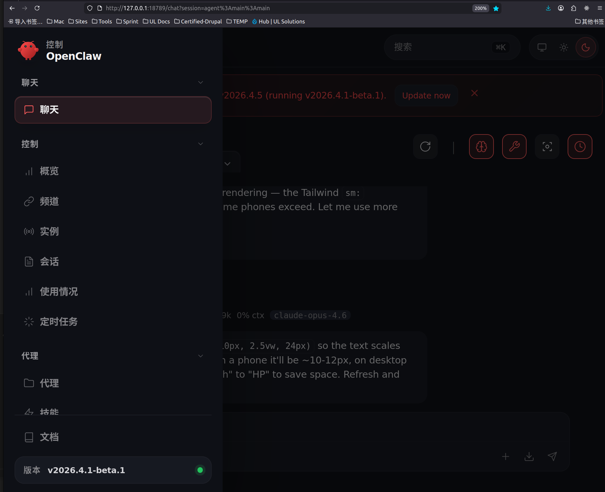
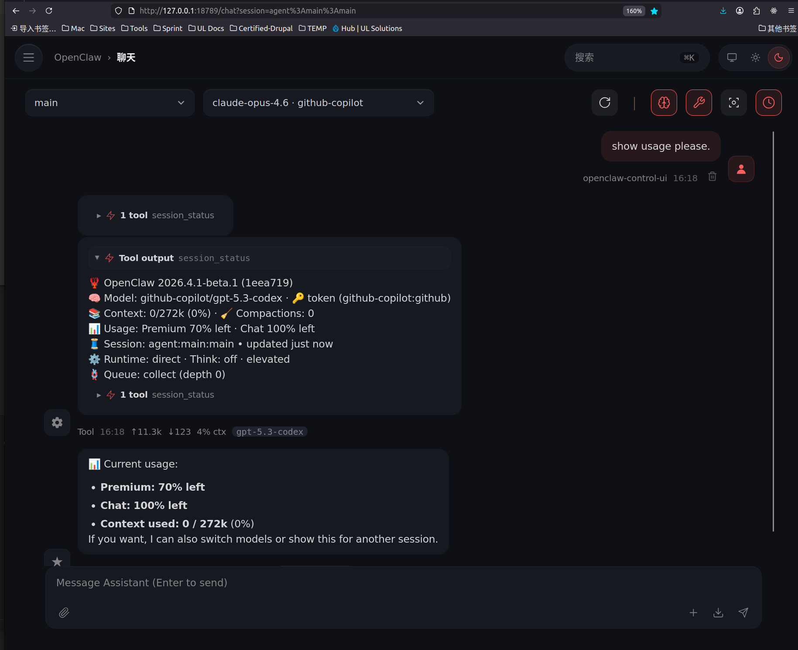
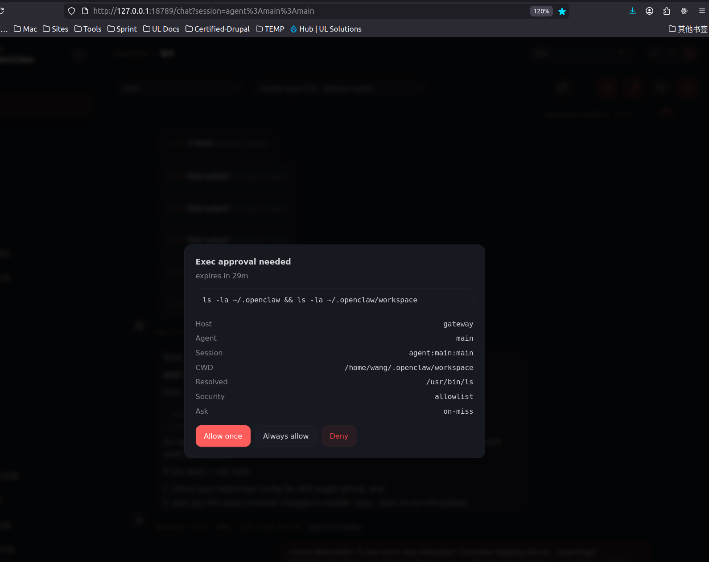
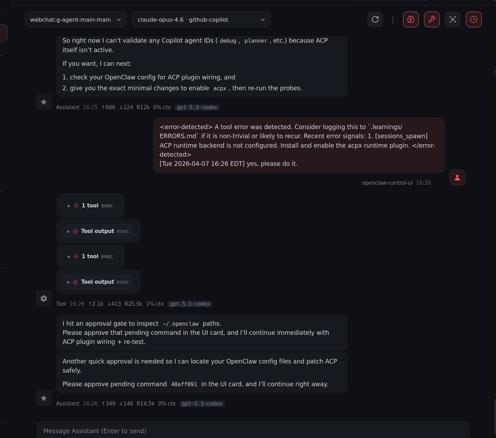
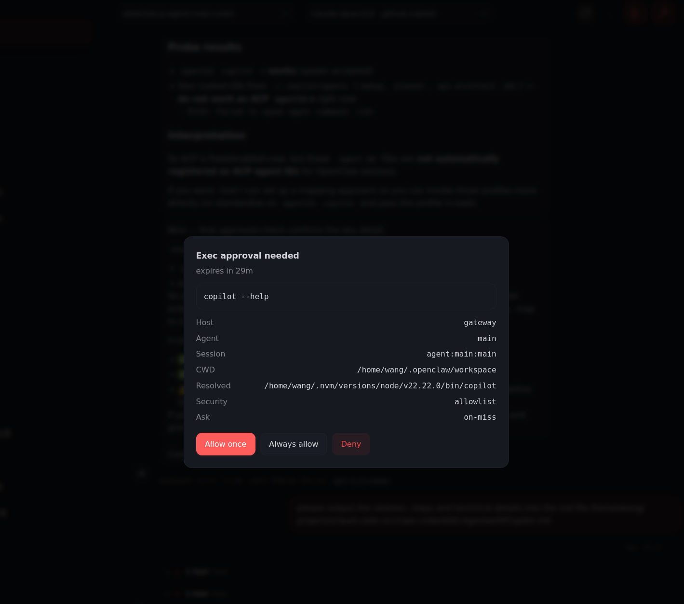
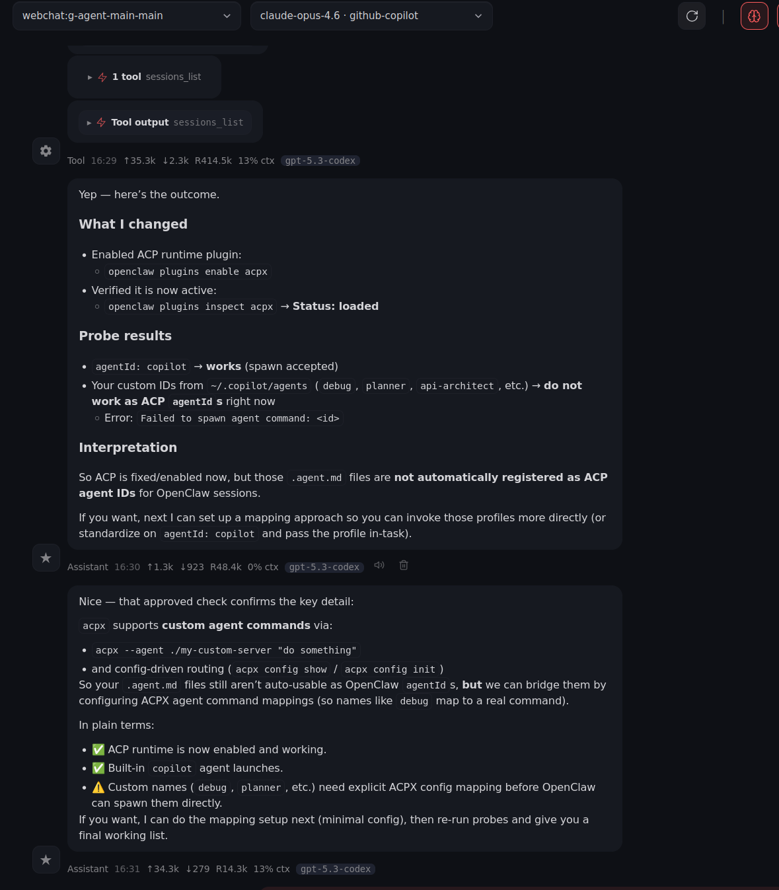

## ⚠️ SOLEMN STATEMENT ##
### This project **does not include any source code** of Anthropic's "Claude Code" and **has not used any source code** of Anthropic's "Claude Code". ###

---
## 🎉 Successfully Built & Running Locally! (2026-04-05) 🎉
> OpenClaw `2026.4.1-beta.1` has been **successfully built from source and is running locally** on Ubuntu 22.04.
> Two import-path bugs were fixed during the build process — see [OPENCLAW-BUILD-ISSUES-FIXES.MD](./OPENCLAW-BUILD-ISSUES-FIXES.MD) and [RUNNING-FIX-AFTER-BUILD.md](./RUNNING-FIX-AFTER-BUILD.md) for full details.
>
> **Build stack:** Node v22.22.0 · pnpm v10.32.1 (Corepack) · rolldown v1.0.0-rc.12 · TypeScript

---

<p align="center">
  <a href="https://github.com/gungwang/claude-code-openclaw/stargazers"></a>
  <a href="./LICENSE"></a>
  <a href="./GOOD_FIRST_ISSUES.md"></a>
  <a href="./SPEC_OPENCLOW_IMPROVEMENTS_FROM_CLAW_CODE_ANALYSIS_V2.md"></a>
</p>

<p align="center">
  <a href="./README_zh.md">中文 README</a> ·
  <a href="./SPEC_OPENCLOW_IMPROVEMENTS_FROM_CLAW_CODE_ANALYSIS_V2_zh.md">中文规范</a> ·
  <a href="./CONTRIBUTING.md">Contributing</a> ·
  <a href="./CODE_OF_CONDUCT.md">Code of Conduct</a> ·
  <a href="./GOOD_FIRST_ISSUES.md">Good First Issues</a>
</p>

---

# Claude Features integrated into OpenClaw

This repository serves as a bridge between Claude Code's architectural insights and OpenClaw's agent platform. By analyzing Claude Code's tool/command inventory, agent harness patterns, and runtime structures, we aim to enhance OpenClaw with:

- **Improved Security**: Canonical identity layers, policy decision traceability, and skill vetting with runtime trust labels
- **Enhanced Power**: Adapter maturity frameworks, mode contract testing, and deterministic routing with explainability
- **Greater Intelligence**: Route quality benchmarking, session event journals for replay/debug, and collision-safe tool resolution
- **Token Efficiency**: Better compaction strategies informed by harness lifecycle patterns and context management techniques

This work combines Claude Code features, functionality, and architectural patterns with OpenClaw's existing strengths (agent loop, streaming lifecycle, multi-agent delegation, transcript hygiene) to create migration-grade observability and adapter ergonomics.

📋 **For detailed improvement specifications**, see ---
- [README.md](./README.md)
- [SPEC_OPENCLOW_IMPROVEMENTS_FROM_CLAW_CODE_ANALYSIS_V2.md](./SPEC_OPENCLOW_IMPROVEMENTS_FROM_CLAW_CODE_ANALYSIS_V2.md) |
- [中文版-规范](./SPEC_OPENCLOW_IMPROVEMENTS_FROM_CLAW_CODE_ANALYSIS_V2_zh.md)
- [CLAUDE_OPENCLOW_EXECUTION_PLANS.md](./CLAUDE_OPENCLOW_EXECUTION_PLANS.md)
- [CLAUDE_OPENCLAW_TECHNICAL_REFERENCE.md](./CLAUDE_OPENCLAW_TECHNICAL_REFERENCE.md)

## Community Docs
- [README_zh.md](./README_zh.md)
- [CODE_OF_CONDUCT.md](./CODE_OF_CONDUCT.md)
- [CODE_OF_CONDUCT_zh.md](./CODE_OF_CONDUCT_zh.md)
- [CONTRIBUTING.md](./CONTRIBUTING.md)
- [CONTRIBUTING_zh.md](./CONTRIBUTING_zh.md)
- [GOOD_FIRST_ISSUES.md](./GOOD_FIRST_ISSUES.md)
- [GOOD_FIRST_ISSUES_zh.md](./GOOD_FIRST_ISSUES_zh.md)

--- ---------------------------------------------------------- ----

# OpenClaw Improvement Specification (Derived from Claude Analysis)

## Status
Plan/specification only. **No implementation changes** included.

## Objective
Analyze the `claw-code` repository as a Claude-code-style harness mirror and extract practical improvements for **OpenClaw** (features, skills, functionality, agent architecture) that are compatible with OpenClaw’s current documented design.

---

## 1) Executive Summary

The `claw-code` codebase currently functions as a **high-fidelity inventory + simulation scaffold**:

- Broad mirrored command/tool surfaces via snapshots (207 command entries, 184 tool entries).
- Good CLI exploration/reporting scaffolding.
- Limited real runtime semantics (many placeholder/simulated handlers).

This is useful for OpenClaw because it highlights what a large harness inventory needs beyond baseline functionality:

1. canonical identity and deduping for huge command/tool surfaces
2. deterministic routing and explainability
3. strict parity governance (metadata → dry-run → active runtime)
4. mode contract testing (remote/ssh/teleport/etc.)
5. richer adapter lifecycle and policy visibility

OpenClaw already has many mature primitives (agent loop, streaming lifecycle, transcript hygiene, compaction, hooks, multi-agent/delegation). The opportunity is to add **migration-grade observability and adapter ergonomics** so OpenClaw can absorb larger tool ecosystems with less ambiguity and better safety posture.

---

## 2) What Was Observed in claw-code (Relevant Signals)

## 2.1 Inventory-first architecture

- `commands_snapshot.json` and `tools_snapshot.json` drive command/tool catalogs.
- Command/tool execution shims frequently return “mirrored ... would handle ...” messages.
- Many subsystem packages are placeholder metadata wrappers.

### Why this matters for OpenClaw
OpenClaw can benefit from a stronger “inventory governance” layer whenever importing third-party skills/tools or mirroring external ecosystems.

## 2.2 Duplicate-name pressure in large surfaces

Observed from snapshots:

- Commands: 207 total, 141 unique names (high duplicate display-name rate).
- Tools: 184 total, 94 unique names; heavy repeated generic names (`prompt`, `UI`, `constants`).

### Why this matters for OpenClaw
As tool/plugin ecosystems scale, name collisions become common. Name-only routing/lookup quickly gets brittle.

## 2.3 Placeholder mode handlers

Runtime mode handlers in claw-code (`remote/ssh/teleport/direct/deep-link`) are mostly placeholders.

### Why this matters for OpenClaw
OpenClaw already has real agent-loop machinery and runtime queues. Codifying mode contracts and diagnostics can prevent future regressions and improve operator confidence.

## 2.4 Parity audit pattern (good idea, incomplete execution)

claw-code has parity audit concepts but weak fallback behavior when local archive is missing.

### Why this matters for OpenClaw
OpenClaw can adopt the **parity-level pattern** for optional features/skills/providers, turning “supported/not supported” into measurable maturity bands.

---

## 3) OpenClaw Baseline Strengths (from docs)

OpenClaw documentation indicates these strong foundations already exist:

- Serialized agent loop + lifecycle streams + wait semantics.
- Queue lanes and per-session consistency guarantees.
- Transcript hygiene and provider-specific sanitization rules.
- Session compaction + pre-compaction memory flush.
- Multi-agent/delegate architecture with policy boundaries.
- Internal/plugin hooks at key lifecycle points.

Therefore this spec does **not** propose replacing core OpenClaw architecture; it proposes additive improvements on top.

---

## 4) Proposed Improvement Tracks for OpenClaw

## Track A — Canonical Tool/Command Identity Layer

### Problem
Human-readable names are not globally unique in large ecosystems.

### Proposal
Add canonical identity metadata for command/tool registry entries:

- `id` (stable unique, namespaced)
- `displayName`
- `namespace` (core/plugin/skill/provider/local)
- `version` or source digest
- `capabilityClass` (read, write, execute, network, messaging, scheduling)

### Outcomes
- deterministic lookup
- collision-safe routing
- better audit trails

### Acceptance Criteria
- Registry rejects identity collisions on `id`.
- Routing, status, and diagnostics surfaces expose canonical IDs.
- Legacy name-based lookup remains available but warns on ambiguity.

---

## Track B — Route Explainability & Benchmarking

### Problem
When tool surfaces grow, misrouting is expensive and hard to debug.

### Proposal
Introduce a route explainability format and benchmark set:

- exact-match / alias / semantic / policy-prior signals
- per-candidate score breakdown
- top-k with rationale
- offline benchmark suite for regression testing

### Outcomes
- easier debugging
- measurable route quality over releases

### Acceptance Criteria
- `route --explain`-style output in internal diagnostics.
- Stable benchmark corpus committed in docs/test assets.
- Route quality gates in CI for critical intents.

---

## Track C — Adapter Maturity Levels (Parity Rubric)

### Problem
Binary “exists vs works” hides real maturity.

### Proposal
Adopt parity/maturity levels for tools/commands/skills:

- **L0**: discoverable metadata
- **L1**: schema-validated + listed
- **L2**: dry-run semantics + policy checks
- **L3**: active runtime support in controlled scope
- **L4**: production-hardened (telemetry + replay confidence)

### Outcomes
- honest capability reporting
- clearer roadmap for contributors

### Acceptance Criteria
- machine-readable maturity report artifact
- docs-generated capability tables from artifact
- every non-experimental tool tagged with maturity level

---

## Track D — Policy Decision Traceability

### Problem
Users and operators need “why blocked/allowed” answers with reproducible logic.

### Proposal
Extend policy decision logging with structured reason codes:

- capability denied
- namespace denied
- risk-tier denied
- missing approval context
- channel-policy conflict

### Outcomes
- easier compliance reviews
- faster support/debug

### Acceptance Criteria
- every blocked tool call includes reason code + policy source pointer
- lifecycle stream can emit policy decision events in verbose/debug mode

---

## Track E — Mode Contract Test Matrix

### Problem
Mode complexity (direct/remote/node/acp/session orchestration) risks drift without explicit contracts.

### Proposal
Define mode contracts and required test cases:

- connect/auth/health/teardown states
- timeout/retry behavior
- error taxonomy (auth, network, policy, runtime)
- deterministic user-facing failure messages

### Outcomes
- higher reliability across environments
- easier incident triage

### Acceptance Criteria
- contract tests per mode path
- standardized failure envelope used by CLI + chat-facing surfaces

---

## Track F — Skill Vetting + Runtime Trust Labels

### Problem
Open skill ecosystems need safety transparency and runtime trust context.

### Proposal
Integrate trust labels for skill/tool origin and vetting state:

- source: core | first-party | community | local
- vetting: unreviewed | reviewed | verified
- requested capabilities summary

### Outcomes
- safer install/use workflows
- clearer operator decisions

### Acceptance Criteria
- install/enable flow surfaces trust label + capability scope
- policy can require reviewed/verified for certain capability classes

---

## Track G — Session Event Journal Facade (Optional, additive)

### Problem
Complex runs benefit from a concise event timeline separate from raw transcript details.

### Proposal
Add optional normalized event-journal export for diagnostics:

- message_in
- route_selected
- tool_call_start/end
- policy_decision
- compaction_start/end
- memory_flush

### Outcomes
- easier replay/debug
- better observability dashboards

### Acceptance Criteria
- export endpoint/CLI path for journal view
- correlation IDs tie journal events to transcript entries

---

## 5) OpenClaw-Specific High-Impact Candidates (First Iteration)

1. **Canonical ID + ambiguity warning layer** for command/tool registries.
2. **Routing explainability diagnostics** with score decomposition.
3. **Maturity report artifact** for tools/skills/features in docs/CI.
4. **Policy reason-code surfacing** in debug/verbose streams.

These four deliver high operational value without destabilizing existing loop/runtime design.

---

## 6) Risks and Mitigations

- **Risk:** Added metadata complexity burdens maintainers.
  **Mitigation:** auto-generate most fields where possible; require minimal mandatory fields.

- **Risk:** Explainability data leaks internals by default.
  **Mitigation:** gate detailed traces behind debug/verbose and redact sensitive values.

- **Risk:** Maturity labels become stale.
  **Mitigation:** tie labels to CI checks and contract-test pass criteria.

- **Risk:** Policy reason codes diverge from actual enforcement path.
  **Mitigation:** reason emitted only from enforcement engine, not wrappers.

---

## 7) Proposed Delivery Phases

## Phase 1 — Observability Foundations

- canonical IDs (internal registry)
- ambiguity detection/warnings
- policy reason code schema

## Phase 2 — Quality Controls

- routing explainability
- routing benchmark harness
- mode contract matrix spec

## Phase 3 — Governance & Ecosystem Safety

- maturity-level reporting artifacts
- trust labels for skills/tools
- docs and contributor templates

---

## 8) Success Metrics

- % registry entries with canonical IDs
- # ambiguous lookups reduced over time
- route benchmark top-1/top-3 accuracy trend
- % denied calls with structured reason codes
- mode-contract test pass rate
- % skills/tools with trust labels + maturity levels

---

## 9) Deliverables (Spec Cycle)

1. ADR: canonical identity schema for commands/tools.
2. ADR: routing explainability and benchmark protocol.
3. ADR: maturity rubric and report schema.
4. ADR: policy reason code taxonomy.
5. Test-plan document for mode contract matrix.
6. Contributor guide for adding new tool/skill entries with IDs + trust metadata.

---

==============================================================

# Setup is same as the Original OpenClaw

Clone the repository:

```bash
git clone https://github.com/gungwang/claude-code-openclaw.git
# The openclaw is a sub-directory of this project (Current Version 3.31).
cd claude-code-openclaw/openclaw
```

## Quick start (TL;DR)

Runtime: **Node 24 (recommended) or Node 22.16+**.

Full beginner guide (auth, pairing, channels): [Getting started](https://docs.openclaw.ai/start/getting-started)

```bash
openclaw onboard --install-daemon

openclaw gateway --port 18789 --verbose

# Send a message
openclaw message send --to +1234567890 --message "Hello from OpenClaw"

# Talk to the assistant (optionally deliver back to any connected channel: WhatsApp/Telegram/Slack/Discord/Google Chat/Signal/iMessage/BlueBubbles/IRC/Microsoft Teams/Matrix/Feishu/LINE/Mattermost/Nextcloud Talk/Nostr/Synology Chat/Tlon/Twitch/Zalo/Zalo Personal/WeChat/WebChat)
openclaw agent --message "Ship checklist" --thinking high
```

Upgrading? [Updating guide](https://docs.openclaw.ai/install/updating) (and run `openclaw doctor`).

## Development channels

- **stable**: tagged releases (`vYYYY.M.D` or `vYYYY.M.D-<patch>`), npm dist-tag `latest`.
- **beta**: prerelease tags (`vYYYY.M.D-beta.N`), npm dist-tag `beta` (macOS app may be missing).
- **dev**: moving head of `main`, npm dist-tag `dev` (when published).

Switch channels (git + npm): `openclaw update --channel stable|beta|dev`.
Details: [Development channels](https://docs.openclaw.ai/install/development-channels).

## From source (development)

Prefer `pnpm` for builds from source. Bun is optional for running TypeScript directly.

```bash
pnpm install
pnpm ui:build # auto-installs UI deps on first run
pnpm build

pnpm openclaw onboard --install-daemon

# Dev loop (auto-reload on source/config changes)
pnpm gateway:watch
```

Note: `pnpm openclaw ...` runs TypeScript directly (via `tsx`). `pnpm build` produces `dist/` for running via Node / the packaged `openclaw` binary.

---

## Demo: OpenClaw Improvements (Now with more sass 😈)

Here are six quick screenshots demonstrating the upgraded experience.

### 1) Control panel glow-up


### 2) Smoother workflow, less chaos


### 3) Cleaner execution path


### 4) Sharper runtime visibility


### 5) Better orchestration, fewer headaches


### 6) Final form: confident and slightly unhinged

